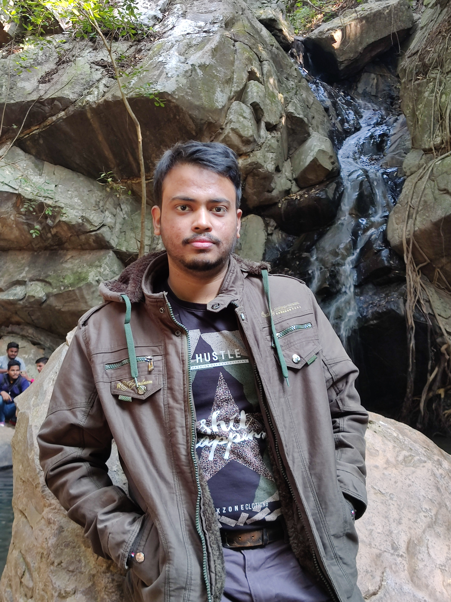

PhD Student in Statistical Physics and Complex Systems.

My research focuses on:

- Active matter
- Nonequilibrium statistical mechanics
- Particle-based simulations
- Bacterial colony modelling

I develop computational models to study emergent collective behavior in active and passive particle systems.

---

## Research Interests

- Active-passive mixtures
- Rod-like particle simulations
- Stochastic dynamics
- Biofilm modelling

---
